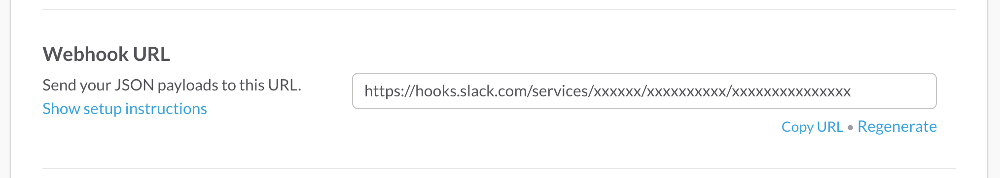
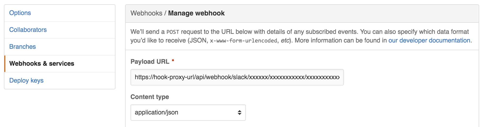

# HookProxy

A stand alone app that acts as a proxy to forward webhooks from one service to another. The proxy can be configured to 
attach a custom message to the front of each webhook message. 

## Supported Services

The app currently supports the forwarding of webhooks to/from the following services

Service From | Service To
-------------|-----------
Github       | Slack
Gitlab       | Slack

## Supported webhook types

The app currently supports the following webhook types

Service | Webhook type 
--------|-------------
Github  | Pull Requests  
Gitlab  | Merge Requests

## Configuration

### Custom message

The app only supports a single custom message per service being forward to. The following variables can be set:

Service To | Env variable
-----------|-------------
Slack      | SLACK_CUSTOM_MESSAGE

## Usage

First generate the url that the webhook will be forwarded to. 

Then create the webhook. Point the url to the hook proxy app deployment with the url generated above appended 
to the end.

Set a custom message on the hook proxy app. Generate a webhook (e.g. create a pull request) and the custom message along
with the original webhook values will be sent to the receiving service. 

  SLACK_CUSTOM_MESSAGE=<@channel>: check this out...

  
